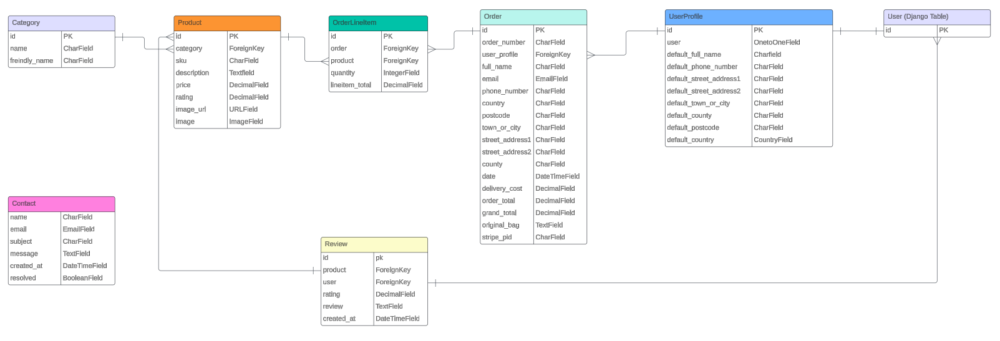
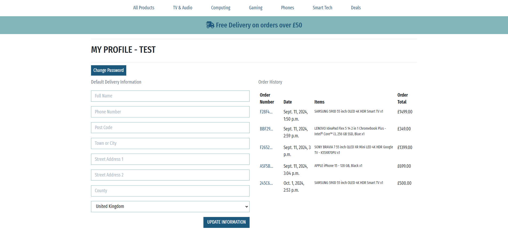
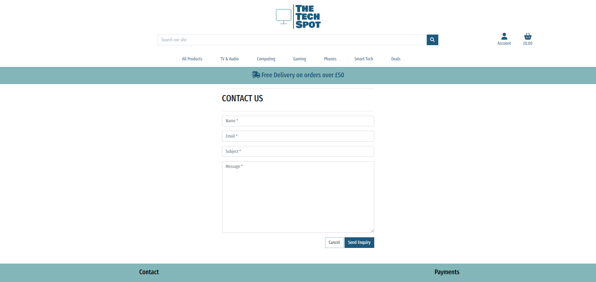

# The Tech Spot

The Tech Spot was created as my fourth milestone project, built using a Django framework alongside sqlite3.


[View The Tech Spot on Heroku](https://the-tech-spot-rd-839ecc701d38.herokuapp.com/)


## CONTENTS

- [User Experience (UX)](#User-Experience-UX)

  - [User Stories](#User-Stories)

- [Design](#Design)

  - [Colour Scheme](#Colour-Scheme)
  - [Typography](#Typography)
  - [Imagery](#Imagery)
  - [Wireframes](#Wireframes)
  - [Database Design](#database-design)
  
- [Features](#Features)
    - [Web Pages](#web-pages)
    - [Accessibility](#Accessibility)

- [Technologies Used](#Technologies-Used)
  - [Languages Used](#Languages-Used)
  - [Frameworks, Libraries & Programs Used](#frameworks-libraries-and-programs-used)

- [Deployment and Local Development](#deployment--local-development)  
    - [Local Development](#Local-Development)
    - [Remote Deployment](#remote-deployment-heroku)
   

- [Testing](#Testing)

  - [Solved Bugs](#Solved-Bugs)
  - [Known Bugs](#Known-Bugs)

- [Credits](#Credits)
  - [Code Used](#Code-Used)
  - [Media](#Media)
  - [Acknowledgments](#Acknowledgments)

---

## User Experience (UX)

### Purpose

The Tech Spot is designed to provide users with an online platform where they can browse, purchase, and learn about the latest tech products, such as TVs, laptops, game consoles, and mobile phones. It aims to offer a convenient shopping experience with detailed product information and secure payment options.

#### Why The Site is Needed

- Convenience: Allows customers to shop from the comfort of their homes, saving time compared to visiting physical stores.

- 24/7 Availability: The platform provides users access to shop anytime, increasing potential sales and customer satisfaction.

- Broader Reach: Expands the customer base beyond local boundaries, enabling users from different regions to access the products.

#### Security Features

- Secure Payment Gateway: Integrates with secure payment service Stripe to handle transactions safely, ensuring credit card information is encrypted.

- User Authentication: Account creation and login require strong passwords and email verification to secure user profiles.

#### Target Audience

- Tech Enthusiasts: People interested in the latest gadgets and technology products.

- General Consumers: Anyone seeking electronic products for everyday use.

- Students and Professionals: Users looking for devices like laptops or mobile phones for work or study.

### User Stories

There are three types of user for The Tech Spot. 

- Shopper - A shopper who doesn't have an account.
- Shopper (with account) - A shopper who has an account.
- Admins - A user(s) who has superuser status, giving them the ability to perform additional tasks such a manage orders, add/delete products.

| **ID** | **As A/AN** | **I Want To Be Able To** | **So I Can** |
|:---:|:---:|:---:|:---:|
|**Viewing and Navigation**|
| **1** | Shopper | Easily navigate the website | To find products/information on products |
| **2** | Shopper | Quickly view a certain category of product  | Locate specific products |
| **3** | Shopper | View individual product details | Determine the price, the description and product rating |
| **4** | Shopper | View the running total of potential purchases  | Keep track of spending |
| **5** | Shopper | View product deals | See which products are on offer  |
|**Registration & User Accounts**|
| **6** | Shopper | Register for an account | Access my profile |
| **7** | Shopper | Login & Out | Access my profile |
| **8** | Shopper | Recover my account incase I forget my password | Re-gain access to my account |
| **9** | Shopper | Receive a verification email after sign up | Verify the account was set up successfully |
| **10** | Shopper | Have a personalized profile page | Update my personal information |
|**Searching & Sorting**|
| **11** | Shopper | Sort products  | Easily sort the best rated, best priced and categorically sort products|
| **12** | Shopper | Sort a specific category of products | Find the best-priced or best-rated product in a specific category, or sort the products in that category by name|
| **13** | Shopper | Sort multiple categories of products simultaneously |  Find the best-priced or best-rated products across all categories |
| **14** | Shopper | Search for products by name, description or keyword  | Easily locate a specific product|
| **15** | Shopper | Easily see what I've searched for and the number of results | Quickly decide whether the product I want is available|
|**Purchasing & Checkout**|
| **16** | Shopper | Select the quantity of a product | Guarantee I select the correct quantity  |
| **17** | Shopper | View items in my bag to be purchased | Identify the total cost of my purchase and all items I will receive  |
| **18** | Shopper | Adjust the quantity of individual items in my bag  | Easily make changes to my purchase before checkout |
| **19** | Shopper | Easily enter my payment information | Check out quickly and with no hassle |
| **20** | Shopper | Feel my personal and payment information is safe and secure | Confidently provide the needed information to make a purchase |
| **21** | Shopper | View an order confirmation after checkout | Check that no mistakes have been made |
| **22** | Shopper | Receive an email confirmation after checking out | Keep the confirmation of what I've purchased for my records and have confidence that the shop has received my order |
|**Admin & Store Management**|
| **22** | Admin | Add a product | Add new items to my store |
| **22** | Admin | Edit/update a product | Change product prices, descriptions, images and other product criteria |
| **22** | Admin | Delete a product | Remove items that are no longer for sale |


## Design

### Colour Scheme


The chosen colour scheme is designed to convey a sense of trust and modernity to The Tech Stop store. 

I believe, together, these colors create a balanced and visually appealing design that reinforces the site’s credibility and modernity, while ensuring a positive user experience.

### Typography

Google Fonts was used for the following fonts:

- Fira Sans Extra Condensed - All text across the site


- Bowlby One - The Tech Spot logo


### Imagery

All images on the webpage were taken from Currys.co.uk. I have credited these in the [credits](#credits) section.

### Wireframes

Wireframes were created for mobile, tablet and desktop using Balsamiq.

<details>
<summary>Desktop, Tablet & Mobile Wireframes</summary>

### Desktop


### Tablet


### Mobile


</details>

### Database Design

The Tech Spot is based on a relational database. The database is made up of 7 tables:

1. Category
2. Product
3. Order
4. OrderLineItem
5. Contact
6. UserProfile
7. User (Django Default Table)

The relationship between the tables are as follows:

1. Category to Product - One-to-Many - One category can have many products

2. Product to OrderLineItem - Many-to-One - One product can be associated with multiple instances of OrderLineItem

3. Order to OrderLineItem - One-to-Many - A single order can have multiple OrderLineItem entries

4. Contact - This is a standalone table which doesn't have a relationship to any other table.

5. UserProfile to User - One-to-One - Only one user can have one user profile.

6. UserProfile to Order - One-to-Many - One user can have many orders.



### Features

All pages of the website have the following elements in common:

- Navbar - The navbar consists of:

    - The Tech Spot logo which acts as a link back to the homepage.
    - A search bar to allow a user to easily search products. 
    - An account icon which allows a user to login/sign up.
    - A basket link which takes the user through to the bag page
    - Navigation links to different product categories


- Footer - This consists of a link to the contact form, which allows a shopper to contact the store. Social links and reference to stripe payments


#### Defensive Programming

Defensive programming has been used throughout the site where necessary to prevent unauthorized access to certain URLs. This has been achieved by using the @loginrequired decorator for certain functions. As a secondary defense the views also check whether the user is a superuser if not a toast is displayed informing the user they do not have access to the URL.

#### Home Page

The home page consist of a welcome message, a shop now button which takes the shopper through to all the products available and a grid of images related to the store.


#### Products Page

The products page displays all of the products available within the store. The products are displayed utilizing a bootstrap grid and card class. Each product shows the name, image, price, category and rating. If the user is a superuser each product shows a update/delete link allowing the superuser to maintain the store.

The page also shows the number of products being displayed on the page on the top left of the page. Additionally if a certain category if being used then a link back to all products is shown and if a search term is used, this term will also be displayed.

To the right of the screen is a sort box allowing the shopper to sort products by price, category and rating.


#### Product Detail Page

Once a user has clicked on a product from the products page they will be taken through to the product detail page. This page shows an image of the product, title, price rating, category and description. If the user is a super user the update/delete links are also displayed here allowing for easy store maintenance 

There is also a quantity input with plus and minus buttons allowing shoppers to select their desired quantity of a product. A shopper is unable to select less than one product. 

Shoppers then have the option to add the quantity to their basket. Once added to the basket a toast is displayed showing the shopper what has been added to the basket and a link to go to secure checkout from the toast.

There is also a keep shopping button which takes the shopper back to the previous page.


#### Bag Page

The bag page displays all of the products which the shopper added to their bag. An image, description, product price, quantity and subtotal is shown for each product. 

The quantity field allows the shopper to update the quantity of the product directly from their shopping bag. The delete link allows the shopper to delete the entire product from their shopping bag.

The subtotal field calculates the quantity multiplied by the product price to give the shopper a subtotal for that product.

The page also displays a bag total, delivery total and grand total.

The keep shopping button takes the shopper back to the products page and the secure checkout button navigates the shopper through to the checkout process.


#### Checkout Page

The checkout page requires the shopper to fill out a form based upon the UserProfile model. If a user is logged in the name and e-mail field are pre-populated. If a user has filled out their profile with their delivery information, the form will be pre-populated with this information. If the user has not pre-populated their delivery information they have the option to save the delivery information to their profile via a checkout box to allow for faster checkout for their next purchase. 

If a shopper does not have a user account/profile then the information will need to be manually entered. There will also be a link displayed underneath the country field to prompt the user to login or to create an account. 

Underneath the details and delivery section is a payment input which is processed by stripe. If a user enters incorrect information a warning message will be displayed underneath the payment input.

The adjust bag button will take the user back to the bag page. The complete order button will complete the purchase and take the user through to the checkout success page. Underneath the complete order button is a warning to the shopper, highlighting to them how much their card will be charged for the purchase.

On the right hand side of the checkout page, shows an order summary to the shopper.


#### Checkout Overlay

Once a shopper has clicked on the complete order button a spinning overlay will be displaying, indicating to the shopper that their payment is being processed. If the payment is unsuccessful the shopper will be re-directed to the checkout page.

#### Checkout Success Page

Once the payment has been processed, the shopper will be presented with the checkout success page. This shows a summary of what has been purchased and informs the shopper that a confirmation email will be sent out to them.

A success toast is also displayed indicating that the purchase was successful.

At the bottom of the summary is a button which will take the shopper through to the stores latest deals.


#### Profile Page

The profile page shows the users default delivery information. Users can update this information at anytime by entering their information and clicking on the update information button. If successful the user will be presented with a success toast. 

On the right hand side of the page displays the users past shopping history. The order number is a link to the order confirmation. 



#### Contact Page

The contact page allows a shopper to easily contact the store. All fields are required fields. If a user is logged in their name and e-mail are pre-populated. Once a user has clicked on the send enquiry button they will be re-directed to the home page and a success toast will be displayed informing them a response can be expected in 1 day.

The cancel button re-directs the user through to the products page. 



#### Add Product (Super Users Only)

Superusers have the ability to add products to the store directly from the website rather than through Django admin. The superuser is presented with a form which is based on the product model. This can be accessed via Account > Product Management link in the navbar. Required fields are marked with an star (*). 

The cancel button takes the user back through to the products page.

The add product button adds the product to the database and directs the user to the product detail page of the newly created product.


#### Edit Product Page (Super Users Only)

Similar to the add product page, super users are able to edit products directly from the website. The edit product page is accessed from the update links next to the products on the product page and product detail page. The form will be pre-populated with the product details and a toast displayed showing the user which product they're updating. From here the superuser can make any necessary amendments.

The cancel button wil take the user back to the products page.

The update product will update the product details and directs the user to the product detail page of the updated product.


#### Delete Product

When a superuser clicks on a delete link for a product they are presented with a modal confirming whether they would like to delete the product. 


#### 400, 403, 404 & 500 Page

I've implemented my own custom error pages. These pages all follow the same design with a message indicated to the user that an error has occurred.


### Future Implementations

- Implement stock levels for each product.
- Add user reviews for each product.
- Implement social login.

## Accessbility

- Using semantic HTML.
- Creating sufficient colour contrast throughout the website.
- Using descriptive alt attributes for images throughout the site.

## Technologies Used

### Languages Used

- HTML, CSS, Javascript and Python

### Frameworks, Libraries and Programs Used

### Database Used

- sqlite3

### Frameworks Used

[Django](https://www.djangoproject.com/) - A high-level Python web framework that encourages rapid development and clean, pragmatic design.

[Bootstrap](https://getbootstrap.com/docs/4.6/getting-started/introduction/) - A framework for building responsive, mobile-first sites.

### Libraries and Packages Used

[Pip](https://pypi.org/project/pip/) - Tool for installing Python packages.

[Jinja](https://jinja.palletsprojects.com/en/3.1.x/) - Templating engine.

[Balsamiq](https://balsamiq.com/) - Used to create wireframes.

[Git](https://git-scm.com/) - For version control.

[Github](https://github.com/) - To save and store the files for the website.

[Gitpod](https://gitpod.com/) - IDE to create the project.

[Google Fonts](https://fonts.google.com/) - To import the fonts used on the website.

Google Dev Tools - To troubleshoot and test features, and solve issues with responsiveness and styling.

[Am I Responsive](https://ui.dev/amiresponsive) To show the website across a range of devices.

[Fontawsome](https://fontawesome.com/start) For the cross and tick.

[Shields](https://shields.io/) Add badges to README.

[Lucid Chart](https://lucid.app) To create the database schema.

[jQuery](https://jquery.com/) - A JavaScript Framework

[Django Allauth](https://django-allauth.readthedocs.io/en/latest/) - Used for authentication, registration & account management.

[django-countries](https://pypi.org/project/django-countries/7.2.1/) 

[django_crispy_forms](https://pypi.org/project/django-crispy-forms/) - 

[gunicorn](https://pypi.org/project/gunicorn/) - a Python WSGI HTTP Server

[pillow](https://pypi.org/project/Pillow/) - Python imaging library

[dj_databsae_url](https://pypi.org/project/dj-database-url/) - allows us to utilise the DATABASE_URL variable

[psycopg2](https://pypi.org/project/psycopg2/) - a postgres database adapter which allow us to connect with a postgres database

[django-storages](https://pypi.org/project/django-storages/) - a storage backend library

[boto3](https://pypi.org/project/boto3/) - Allows connection to AWS S3 bucket

[coverage](documentation/testing/coverage/checkout-forms.png) - Used to create test reports

### Stripe

[Stripe](https://stripe.com/gb) has been used in the project to implement the payment system.

The following card numbers can be used to test different payment scenarios.

| Type | Card No | Expiry | CVC | ZIP |
| :--- | :--- |:--- | :--- | :--- |
| Success| Visa | 4242 4242 4242 4242 | A date in the future | Any 3 digits | Any 5 digits |
| Require authorisation | 4000 0027 6000 3184 | A date in the future | Any 3 digits | Any 5 digits |
| Declined | 4000 0000 0000 0002 | A date in the future | Any 3 digits | Any 5 digits |


## Deployment & Local Development

### Local Development

### Remote Deployment Heroku

1. Create a database using [CI Database Maker](https://dbs.ci-dbs.net/). Once created, a URL to the database will be provided. Save this URL for later on in the process.


### How to Fork

To fork the repository:

1. Log in (or sign up) to Github.

2. Go to the repository for this project, [The Tech Spot](https://github.com/rdhadda/the-tech-spot).

3. Click the Fork button in the top right corner.

### How to Clone

1. Log in (or sign up) to GitHub.

2. Navigate to the repository for this project [The Tech Spot](https://github.com/rdhadda/the-tech-spot).

3. Click the Code button and choose to clone using HTTPS, SSH, or the GitHub CLI, then copy the link.

4. Open the terminal in your chosen IDE and change the directory to where you'd like to clone the repository:

    ``` cd <desired-directory> ```


5. Clone the repository by typing the following command:

    ``` git clone <https://github.com/rdhadda/the-tech-spot.git> ```


6. Create and activate a virtual environment.

7. Install the required packages by running the following command:

    ``` pip install -r requirements.txt ```

### Remote Deployment Heroku

1. Create a database using [CI Database Maker](https://dbs.ci-dbs.net/). Once created, a URL to the database will be provided. Save this URL for later on in the process.

2. Login (or sign up) to [Heroku.com](https://www.heroku.com).

3. Click the new button and then click Create New App.

4. Choose a unique name for your app, select the region closest to you and click “Create app.

5. Go to the Settings tab of your new app.

6. Click Reveal Config Vars.

7. Add a Config Var called DATABASE_URL and paste your CI database URL in as the value. Make sure you click “Add”.
   - Note - Don't wrap strings in quotes.

8. Install dj_database_url and psycopg2 (they are both needed for connecting to the external database you've just set up):

   ```bash
   pip3 install dj_database_url==0.5.0 psycopg2
   ```

9. Update your requirements.txt file with the packages just installed:

    ```bash
    pip3 freeze > requirements.txt
    ```

10. In settings.py underneath import os, add `import dj_database_url`

11. Scroll to the DATABASES section and update it to the following code, so that the original connection to sqlite3 is commented out and we connect to the new database instead. Paste in the database URL from your PostgreSQL from Code Institute email in the position indicated

    

    ```python
     # DATABASES = {
     #     'default': {
     #         'ENGINE': 'django.db.backends.sqlite3',
     #         'NAME': os.path.join(BASE_DIR, 'db.sqlite3'),
     #     }
     # }
          
     DATABASES = {
          'default': dj_database_url.parse('your-database-url-here')
     }
    ```
     - Note - DO NOT commit this file with your database string in the code, this is temporary so that we can connect to the new database and make migrations. It will be removed later on.


12. In the terminal, run the show migrations command to confirm connection to the external database:

    ```bash
    python3 manage.py showmigrations
    ```

13. If you are, you should see a list of all migrations, but none of them are checked off. Migrate your database to your new database with the command:

    ```bash
    python3 manage.py migrate    
    ```

14. Load in the fixtures. Please note the order is very important here. We need to load categories first and then products:

    ```bash
    python3 manage.py loaddata categories
    ```
    ```
    python3 manage.py loaddata products
    ```

15. Create a superuser for the new database. Input a username, email and password once prompted.

    ```bash
    python3 manage.py createsuperuser
    ```

16. We can now add an if/else statement for the databases in settings.py, so we use the development database while in development and the external database once deployed to Heroku.

    ```python
    if 'DATABASE_URL' in os.environ:
        DATABASES = {
          'default': dj_database_url.parse(os.environ.get('DATABASE_URL'))
        }
    else:
        DATABASES = {
            'default': {
                'ENGINE': 'django.db.backends.sqlite3',
                'NAME': os.path.join(BASE_DIR, 'db.sqlite3')
          }
        }
    ```

17. Install gunicorn which will act as a webserver and freeze this to the requirements.txt file:

    ```bash
    pip3 install gunicorn
    pip3 freeze > requirements.txt
    ```

18. Create a `Procfile` in the root directory. 

    ```Procfile
    web: gunicorn the_tech_spot.wsgi:application
    ```
     - NOTE: The Procfile uses a capital P and doesn't have a file extension on the end. Ensure there is no blank line at the end of the file as this can cause problems for deployment.

19. Log into the Heroku CLI in the terminal using the command ``` heroku login -1 ``` and then run the following command to disable collectstatic. This command tells Heroku not to collect static files once deployed:

    ```bash
    heroku config:set DISABLE_COLLECTSTATIC=1 --app heroku-app-name-here
    ```

20. Add the Heroku app and localhost  to ALLOWED_HOSTS = [] in settings.py:

    ```python
    ALLOWED_HOSTS = ['{heroku deployed site URL here}', 'localhost' ]
    ```

21. Save, add, commit and push the changes to GitHub. Initialize the Heroku git remote in the terminal and push to Heroku with:

    ```bash
    heroku git:remote -a {app name here}
    git push heroku master
    ```

22. The site should now be deployed to Heroku (without static files)

23. In the Deployment method section, select “Connect to GitHub”. Search for the-tech-spot repo and click Connect.

    Optional: You can click Enable Automatic Deploys in case you make any further changes to the project. This will trigger any time code is pushed to your GitHub repository.

### AWS Setup for Static & Media Files

1. Create an AWS account at [AWS](https://aws.amazon.com/) if you don't have one already.

2. From the services menu search for S3. Once selected click the create bucket button.

3. Choose a unique name for your bucket and select the region closet to you along with ACLs enabled and bucket owner preferred selected. 

4. Uncheck the block all public access checkbox and accept the warning and click create bucket.

5. Select the newly created bucket and click on the properties tab and enable static web hosting.

6. Now click on the permissions tab and add the following CORS configuration:

   ``` 
      [
      {
          "AllowedHeaders": [
              "Authorization"
          ],
          "AllowedMethods": [
              "GET"
          ],
          "AllowedOrigins": [
              "*"
          ],
          "ExposeHeaders": []
      }
    ]
    ````

7. Under the bucket policy section click edit then policy generator:

    - Type of Policy = S3 Bucket Policy
    - Principal = *
    - Action = Get Object
    - ARN = Your Bucket ARN
  
  - Click Add Statement
  - Click Generate Policy

8. Copy the policy and add it to the bucket policy editor with a ```/*``` at the end of the bucket name:

   ```
        {
        "Version": "2012-10-17",
        "Id": "Policy1727082327879",
        "Statement": [
          {
            "Sid": "Stmt1727082324735",
            "Effect": "Allow",
            "Principal": "*",
            "Action": "s3:GetObject",
            "Resource": "arn:aws:s3:::your-bucket-name/*"
          }
        ]
      }
  

9. On the access control list section under the permissions tab, click edit and check the Everyone(public access) check box.

#### Create an IAM User

1. From the services menu search for IAM. Once selected click the User Groups link.

2. Choose a name for the new group.

3. Under the access management dropdown select polices.

4. Click create policy.

5. Go to the JSON tab and under the actions dropdown, select the import policy link.

6. Import the AmazonS3FullAccess policy.

7. Under the resources part of the policy we need to make a few changes by adding our ARN. The policy should look like the following:

   ```
        {
        "Version": "2012-10-17",
        "Statement": [
            {
                "Effect": "Allow",
                "Action": [
                    "s3:*",
                    "s3-object-lambda:*"
                ],
                "Resource": [
                    "arn:aws:s3:::your-bucket",
                    "arn:aws:s3:::your-bucket/*"
                ]
            }
        ]
    }

   ```
8. Click review policy. Give the policy a name and a description then click create policy.

9. Click User Groups from the access management dropdown. Go to the permissions tab. From the add permissions drop select attach policies.

10. Search for the newly created policy and select it. And then click attach policy.

11. Next a user needs to be created for the group.

12. From the access management dropdown select User. Then click add user.

13. Choose a user name. Click next and then add the user to the user group. Click create user.

14. We then need to retrieve the user access key and secret access key to use in Heroku config vars:

      1. Please follow the steps below to get the CSV file.
      2. Go to IAM and select 'Users'
      3. Select the user for whom you wish to create a CSV file.
      4. Select the 'Security Credentials' tab
      5. Scroll to 'Access Keys' and click 'Create access key'
      6. Select 'Application running outside AWS', and click next
      7. On the next screen, you can leave the 'Description tag value' blank. Click 'Create Access Key'
      8. Click the 'Download .csv file' button (keep the file safe as it can't be accessed again)

#### Connecting Django to S3

1. Install boto3 and django storages and freeze them to the requirements.txt file.

    ```
    pip3 install boto3
    pip3 install django-storages
    pip3 freeze > requirements.txt

    ```

2. Add `storages` to the installed apps in settings.py

3. Add the following code in settings.py to use the S3 bucket if using the deployed site:

    ```python
    if 'USE_AWS' in os.environ:
        AWS_S3_OBJECT_PARAMETERS = {
            'Expires': 'Thu, 31 Dec 2099 20:00:00 GMT',
            'CacheControl': 'max-age=9460800',
        }
        
        AWS_STORAGE_BUCKET_NAME = 'enter your bucket name here'
        AWS_S3_REGION_NAME = 'enter the region you selected here'
        AWS_ACCESS_KEY_ID = os.environ.get('AWS_ACCESS_KEY_ID')
        AWS_SECRET_ACCESS_KEY = os.environ.get('AWS_SECRET_ACCESS_KEY')
        AWS_S3_CUSTOM_DOMAIN = f'{AWS_STORAGE_BUCKET_NAME}.s3.amazonaws.com'
    ```

4. In Heroku add these keys to our config vars:

    | KEY | VALUE |
    | :--- | :--- |
    | AWS_ACCESS_KEY_ID | The access key value from the amazon csv file downloaded in the last section |
    | AWS_SECRET_ACCESS_KEY | The secret access key from the amazon csv file downloaded in the last section |
    | USE_AWS | True |

5. Remove the DISABLE_COLLECTSTATIC variable from Heroku config vars.

6. Create a file called custom_storages.py in the root and import settings and S3Botot3Storage. Create a custom class for static files and one for media files. These will tell the app the location to store static and media files.

    ```
        from django.conf import settings
        from storages.backends.s3boto3 import S3Boto3Storage


        class StaticStorage(S3Boto3Storage):
        location = settings.STATICFILES_LOCATION


        class MediaStorage(S3Boto3Storage):
        location = settings.MEDIAFILES_LOCATION
    ```

7. Add the following to settings.py to let the app know where to store static and media files, and to override the static and media URLs in production.

    ```python
    STATICFILES_STORAGE = 'custom_storages.StaticStorage'
    STATICFILES_LOCATION = 'static'
    DEFAULT_FILE_STORAGE = 'custom_storages.MediaStorage'
    MEDIAFILES_LOCATION = 'media'
    
    STATIC_URL = f'https://{AWS_S3_CUSTOM_DOMAIN}/{STATICFILES_LOCATION}/'
    MEDIA_URL = f'https://{AWS_S3_CUSTOM_DOMAIN}/{MEDIAFILES_LOCATION}/'
    ```

8. Push your changes to deploy to Heroku.
In the build log, verify that the static files have been collected successfully.
Check your S3 bucket to confirm that the static folder now contains all the required static files for the project.

9. Open your S3 bucket.
To create a folder for media files, click the Create folder button in the top-right corner.
Name the new folder media and upload all of the media files for the project here.

#### Stripe Setup

1. Add the webhook endpoint to Stripe for the newly deployed site. Select all events and click create endpoint.

2. Finally add all remaining config vars to heroku it should look similar to the following:

    

The deployed site should now be fully functioning

## Testing

Please see [TESTING.md](TESTING.md) file for both automated and manual testing of The Tech Spot.

## Credits

### Code Used

The Tech Spot, was developed following techniques from Code Institute's Boutique Ado walkthrough.

### Media

Logo.com for the Tech Spot Logo

### Acknowledgments

- My mentor for their guidance and support.
- Tutor support for helping me overcome compatibility issues.
- My cohort for support.
- Code Institute for informative course material.
- The Slack community for help and support.