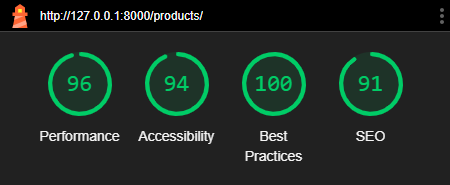
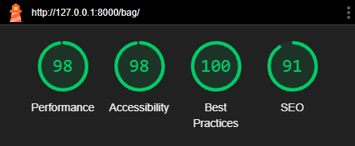
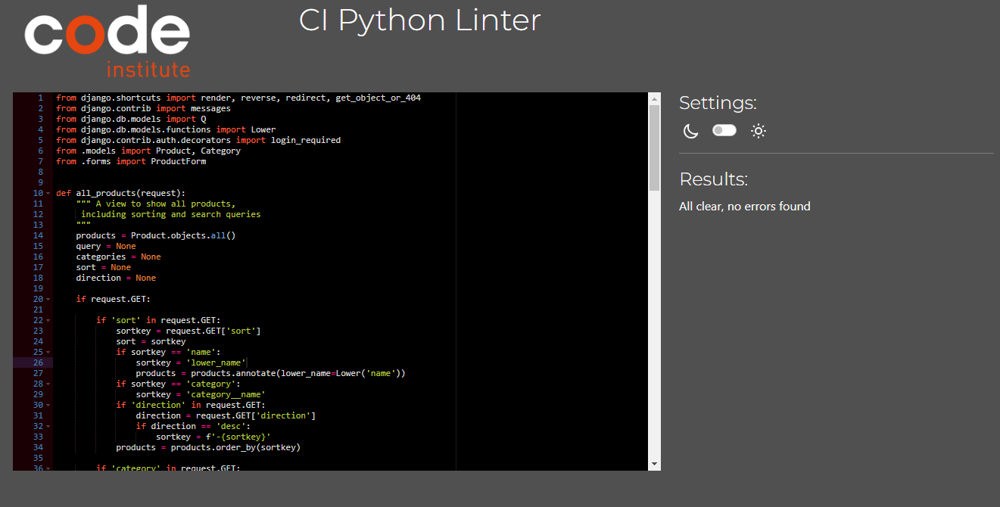

# The Tech SPot - Testing


[View The Tech Spot on Heroku]()

## CONTENTS

- [Automated Testing](#Automated-Testing)
  - [W3C Validator](#W3C-Validator)
  - [JavaScript Validator](#JavaScript-Validator)
  - [Lighthouse Testing](#Lighthouse-Testing)
  - [Wave Testing](#Wave-Testing)
  - [CI Python Linter](#ci-python-linter)
- [Manual Testing](#Manual-Testing)
  - [Testing User Stories](#Testing-User-Stories)
  - [Full Testing](#Full-Testing)
- [Bugs](#bugs)
  - [Solved Bugs](#solved-bugs)
  - [Known Bugs](#known-bugs)

## Testing

Testing was continuous throughout the website build. I used Chrome developer tools to identify and address any issues as they arose.

- My automated testing consisted of using W3C Validator, JSHint, Lighthouse, Wave the CI Linter Python and Coverage (Django Unit Testing).
- I then manually tested the user stories along with the functionality of the website.

## Automated Testing

### W3C Validator

<details>
<summary>W3 Validator for HTML</summary>

# W3C HTML Validator

W3C validator was used to validate the HTML on all pages of the website. It was also used to validate CSS in the style.css file.

#### Homepage  
  

#### Products Page  
  

#### Products Detail Page  
  

#### Add Product Page  
  

#### Edit Product  
  

#### Bag Page  

- I had one error on the bag page of a trailing div tag. Unfortunately I cannot locate where the trailing div is. 

  

#### Checkout Page  
  

#### Checkout Success Page  
  

#### Profile Page  
  

#### Contact Page  
   

</details>

<details>
<summary>W3 Validator for CSS</summary>

# W3C Validator for CSS

#### base.css


#### checkout.css


#### profile.css


</details>

### JavaScript Validator

JSHint was used to validate the JavaScript.

- All test successfully passed.

<details>
<summary>JS Hint Validator</summary>

## Checkout App

### stripe_elements.js


## Profiles App

### countryfield.js


</details>

### Lighthouse Testing

I took the opportunity to utilize Lighthouse within Chrome Developer Tools. This allowed me to test for performance, accessibility, best practices and the SEO (search engine optimization) of the website.

- All pages pass Googles lighthouse tests for Desktop and Mobile.

#### Desktop Testing

<details>
<summary>Lighthouse Desktop Testing Screen Shots</summary>

#### Homepage


#### Products Page


#### Products Detail Page


#### Add Product Page


#### Edit Product


#### Bag Page


#### Checkout Page


#### Checkout Success Page


#### Profile Page


#### Contact Page


</details>

#### Mobile Testing

<details>
<summary>Lighthouse Mobile Testing Screen Shots</summary>

#### Homepage


#### Products Page


#### Products Detail Page


#### Add Product Page


#### Edit Product


#### Bag Page


#### Checkout Page


#### Checkout Success Page


#### Profile Page


#### Contact Page


</details>

### Wave Testing

All pages pass the Wave validator.

<details>
<summary>Wave Testing</summary>

#### Homepage


#### Products Page


#### Products Detail Page


#### Add Product Page


#### Edit Product


#### Bag Page


#### Checkout Page


#### Checkout Success Page


#### Profile Page


#### Contact Page


</details>

### Django Unit Testing Using Coverage

I wrote a number of tests using Django TestCase. I concentrated on writing tests for forms, models and views. 

I used Coverage to see where tests were missing to enable me to test the app in areas with a low percentage.

After writing a number of tests I managed to reach 69% coverage. 

<details>
<summary>Django Unit Testing Using Coverage</summary>

#### Coverage Testing

Coverage was utilised in the following way:

##### Step 1: Install Coverage

Install Coverage

```bash
pip install coverage
```

##### Step 2: Run Tests with Coverage

Run all test throughout the whole of the application

```bash
coverage run --source='.' manage.py test
```

##### Step 3: Generate Coverage Report

Generate a coverage report for the whole of the application.

```bash
coverage report
```

##### Generated Coverage Report:

```bash
Name                                                        Stmts   Miss  Cover
-------------------------------------------------------------------------------
bag\__init__.py                                                 0      0   100%
bag\admin.py                                                    1      0   100%
bag\apps.py                                                     4      0   100%
bag\contexts.py                                                22      6    73%
bag\migrations\__init__.py                                      0      0   100%
bag\models.py                                                   1      0   100%
bag\templatetags\__init__.py                                    0      0   100%
bag\templatetags\bag_tools.py                                   6      2    67%
bag\test_views.py                                              23      0   100%
bag\urls.py                                                     3      0   100%
bag\views.py                                                   39     15    62%
checkout\__init__.py                                            1      0   100%
checkout\admin.py                                              12      0   100%
checkout\apps.py                                                6      0   100%
checkout\forms.py                                              28      0   100%
checkout\migrations\0001_initial.py                             6      0   100%
checkout\migrations\0002_alter_order_country.py                 5      0   100%
checkout\migrations\0003_order_user_profile.py                  5      0   100%
checkout\migrations\__init__.py                                 0      0   100%
checkout\models.py                                             50     14    72%
checkout\signals.py                                             9      2    78%
checkout\test_forms.py                                         22      0   100%
checkout\urls.py                                                4      0   100%
checkout\views.py                                              87     71    18%
checkout\webhook_handler.py                                    75     59    21%
checkout\webhooks.py                                           28     19    32%
contact\__init__.py                                             0      0   100%
contact\admin.py                                                8      0   100%
contact\apps.py                                                 4      0   100%
contact\forms.py                                               20      1    95%
contact\migrations\0001_initial.py                              5      0   100%
contact\migrations\__init__.py                                  0      0   100%
contact\models.py                                              10      0   100%
contact\test_forms.py                                          15      0   100%
contact\test_models.py                                          9      0   100%
contact\test_views.py                                           6      0   100%
contact\urls.py                                                 3      0   100%
contact\views.py                                               23     12    48%
custom_storages.py                                              6      6     0%
env.py                                                          7      0   100%
home\__init__.py                                                0      0   100%
home\admin.py                                                   1      0   100%
home\apps.py                                                    4      0   100%
home\migrations\__init__.py                                     0      0   100%
home\models.py                                                  1      0   100%
home\test_views.py                                              6      0   100%
home\urls.py                                                    3      0   100%
home\views.py                                                   3      0   100%
manage.py                                                      11      2    82%
products\__init__.py                                            0      0   100%
products\admin.py                                               9      0   100%
products\apps.py                                                4      0   100%
products\forms.py                                              16      0   100%
products\migrations\0001_initial.py                             6      0   100%
products\migrations\__init__.py                                 0      0   100%
products\models.py                                             21      0   100%
products\test_forms.py                                          7      0   100%
products\test_models.py                                        12      0   100%
products\test_views.py                                         19      0   100%
products\urls.py                                                3      0   100%
products\views.py                                              88     61    31%
products\widgets.py                                             7      0   100%
profiles\__init__.py                                            0      0   100%
profiles\admin.py                                               1      0   100%
profiles\apps.py                                                4      0   100%
profiles\forms.py                                              27      1    96%
profiles\migrations\0001_initial.py                             8      0   100%
profiles\migrations\0002_userprofile_default_full_name.py       4      0   100%
profiles\migrations\__init__.py                                 0      0   100%
profiles\models.py                                             22      0   100%
profiles\test_models.py                                         8      0   100%
profiles\test_views.py                                         19      0   100%
profiles\urls.py                                                3      0   100%
profiles\views.py                                              26      6    77%
the_tech_spot\__init__.py                                       0      0   100%
the_tech_spot\asgi.py                                           4      4     0%
the_tech_spot\settings.py                                      72     20    72%
the_tech_spot\urls.py                                           5      0   100%
the_tech_spot\wsgi.py                                           4      4     0%
-------------------------------------------------------------------------------
TOTAL                                                         981    305    69%
```
</details>

### CI Python Linter

- All Python code is consistent in style and conforms to the PEP8 style guide. The CI Python Linter has been used to check that the code conforms to PEP8 standard. This includes indentation, comments, trailing white spaces, maximum line length etc. 

- All tests successfully pass.

<details>
<summary>CI Python Linter Results</summary>

## The Tech Spot

### settings.py


### urls.py


## Bag App

### apps.py


### bag_tools.py


### context.py


### test_views.py


### urls.py


### views.py


## Checkout App

## admin.py


## apps.py


## forms.py


## signals.py


## models.py


## test_forms.py


## urls.py


## views.py


## webhook_handler.py


## webhooks.py


## Home App

## apps.py


## urls.py


## views.py


## test_views.py


## Products App

## admin.py


## apps.py


## forms.py


## models.py


## test_forms.py


## test_models.py


## test_views.py


## urls.py


## views.py


## widgets.py


## Profiles App

## apps.py


## forms.py


## models.py


## test_models.py


## test_views.py


## urls.py


## views.py


## Contact App

## admin.py


## apps.py


## forms.py


## models.py


## test_forms.py


## test_models.py


## test_views.py


</details>

### Manual Testing

#### Testing User Stories

| **ID** | **As A/AN** | **I Want To Be Able To** | **So I Can** | **How Is This Achieved** |
|:---:|:---:|:---:|:---:|:---:|
| **Viewing and Navigation** |
| **1** | Shopper | Easily navigate the website | To find products/information on products | User-friendly navigation menu with a clean design and clear categories |
| **2** | Shopper | Quickly view a certain category of product | Locate specific products | The categories for each product type are accessible from the navbar |
| **3** | Shopper | View individual product details | Determine the price, description, and product rating | A product details page with an image, price, description and rating  |
| **4** | Shopper | View the running total of potential purchases | Keep track of spending | Subtotal displayed in the shopping bag with real-time calculations as products are added to the bag |
| **5** | Shopper | View product deals | See which products are on offer | Link to the deals page on the navbar |
| **Registration & User Accounts** |
| **6** | Shopper | Register for an account | Access my profile | User registration form accessible from the account icon on the navbar |
| **7** | Shopper | Login & Out | Access my profile | Login/logout functionality which can be accessed from the account icon on the navbar  |
| **8** | Shopper | Recover my account in case I forget my password | Regain access to my account | Password recovery option where an e-mail link will be sent to the user for a password reset |
| **9** | Shopper | Receive a verification email after sign up | Verify the account was set up successfully | Once a user has signed up to the website an automated e-mail will be sent asking the user to verify their e-mail |
| **10** | Shopper | Have a personalized profile page | Update my personal information | User profile management page, which displayed a form to editing profile details  |
| **Searching & Sorting** |
| **11** | Shopper | Sort products | Easily sort by ratings, price, and categories | Dropdown menu on the products page with a variety of sorting options |
| **12** | Shopper | Sort a specific category of products | Find the best-priced or best-rated product in a specific category | Dropdown menu allowing a user to sort products from low to high prices and highest to lowest rated |
| **13** | Shopper | Sort multiple categories of products simultaneously | Find the best-priced or best-rated products across all categories | On the all products page the dropdown menu can be used to sort products on depending on the shoppers needs |
| **14** | Shopper | Search for products by name, description, or keyword | Easily locate a specific product | Search bar on the website available across all pages where keywords will match with product descriptions  |
| **15** | Shopper | Easily see what I've searched for and the number of results | Quickly decide whether the product I want is available | A display of search results and count of products displayed |
| **Purchasing & Checkout** |
| **16** | Shopper | Select the quantity of a product | Guarantee I select the correct quantity | Quantity selector on the product detail page and on the bag page |
| **17** | Shopper | View items in my bag to be purchased | Identify the total cost of my purchase and all items I will receive | All items in the shopping bag can be displayed by clicking on the shopping basket in the navbar. This will display all items in the bag and total cost of all items |
| **18** | Shopper | Adjust the quantity of individual items in my bag | Easily make changes to my purchase before checkout | Quantity adjustment is available on the bag page to allow a user to adjust the quantity of items before checkout, without having to go back to the product detail page |
| **19** | Shopper | Easily enter my payment information | Check out quickly and with no hassle | On the checkout page there is a section for the user to fill out their payment information. Immediate feedback is provided an issue is detected  |
| **20** | Shopper | Feel my personal and payment information is safe and secure | Confidently provide the needed information to make a purchase | All payments are taken using Stripe a secure third party payment system |
| **21** | Shopper | View an order confirmation after checkout | Check that no mistakes have been made | An order confirmation page is displayed directly after a purchase is made. This gives a summary of the order details post-purchase  |
| **22** | Shopper | Receive an email confirmation after checking out | Keep the confirmation of what I've purchased for my records | An automated email is sent to the user after a purchase is made |
| **Admin & Store Management** |
| **23** | Admin | Add a product | Add new items to my store | A product management dropdown can be accessed from the account icon on the navbar. This option is only visible if the user is a super.user. Once accessed a form is displayed allowing the admin to add a product to the store |
| **24** | Admin | Edit/update a product | Change product prices, descriptions, images, and other product criteria | Super users have access to edit links on both the product and product detail page. The link takes the admin through to a form where any product details can be amended |
| **25** | Admin | Delete a product | Remove items that are no longer for sale | Super users have access to a delete link on the product and product detail pages. Once clicked the admin will be presented with modal confirming they would like to delete the chosen product |


### Full Testing

Full testing was performed on the following devices:

- Laptop:

  - Macbook Pro 2015 13 inch screen

- Mobile Devices:
  - iPhone 15 pro.
  - iPhone 12 pro.
  - iPhone 11 pro.
  - Phone X.

Each device tested the site using the following browsers:

- Google Chrome
- Safari

#### Nav Bar

| Feature | Expected Outcome | Testing Performed | Result  | Pass/Fail |
|---|---|---|---|---|
| The Tech Spot Logo | Link directs the user back to the home page | Clicked logo | Home page reloads |Pass |
| Search Bar - Search Term | All results are shown with the search term being displayed  | Searched for a product | Results were displayed with search term displayed |Pass |
| Search Bar - No Search Term | Error toast displayed  | Search without a search term | Toast displayed highlighting no search term was entered |Pass |
| Account Icon - Logged In | My profile and Sign out linked displayed  | Clicked account icon | My profile and Sign out linked displayed  |Pass |
| Account Icon - Logged In Admin | Product Management, My profile and Sign out links displayed  | Clicked account icon | Product Management, My profile and Sign out links displayed  |Pass |
| Account Icon - Logged Out | Register and Sign In links displayed  | Clicked account icon | Register and Sign In links displayed |Pass |
| Bag Icon | Value underneath the icon should update as products are added to the bag  | Added product to the bag | Value underneath the bag icon updates |Pass|
| Bag Icon - Click | Takes the user through to the bag page if the bag item is clicked  | Clicked bag item | bag page displayed |Pass|
| Category links | Takes use through to all the products matching the chosen category  | Clicked each category link | Corresponding products pages are displayed |Pass||

#### Footer


| Feature | Expected Outcome | Testing Performed | Result  | Pass/Fail |
|---|---|---|---|---|
| Contact the Tech Spot Link| Link directs the user to the contact form | Clicked link | Contact form loads |Pass |
| Social Links | Link directs the user to the chosen social media page in a new tab | Clicked link | Contact social page loads in a new tab |Pass |

#### Home Page

| Feature | Expected Outcome | Testing Performed | Result  | Pass/Fail |
|---|---|---|---|---|
| Shop Now Button| Link directs the user to the all products page | Clicked link | All products page loads |Pass |

#### Products Page

| Feature | Expected Outcome | Testing Performed | Result  | Pass/Fail |
|---|---|---|---|---|
| Sort By Dropdown | Products are sorted depending on the option chosen | Clicked the dropdown and selected a variety of options | Products are sorted by the selected option |Pass |
| Product Detail | Clicking on an image of a product will direct a user to the product detail page | Clicked the product image | Product detail page is displayed |Pass |
| Back to top arrow | Clicking on the arrow will take the user back to the top of the page | Clicked the arrow | Top of the page is displayed |Pass |
| Category link below image | Clicking on the link will take the user through to a page of products of that category type | Clicked the link | Products of that category are displayed |Pass |

#### Product Detail Page

| Feature | Expected Outcome | Testing Performed | Result  | Pass/Fail |
|---|---|---|---|---|
| Image - Click | A new tab is opened with the image displayed | Clicked the image | Image displayed in a new tab |Pass |
| Quantity Minus Button | Decreases the desired quantity. The minus button doesn't allow the user to go below 1 | Clicked the minus button | Quantity doesn't go below 1, but does decrease by 1 if the quantity is at more than one |Pass |
| Quantity Plus Button | Increases the desired quantity. The plus button doesn't allow the user to go above 99 | Clicked the plus button | Quantity doesn't go above 99, but does increase by 1 if the quantity is below 99 |Pass |
| Add to cart button| Adds the product to the bag with the desired quantity and toast displayed | Clicked the add to cart button | Correct quantity and product added to bag and toast displayed |Pass |
| Keep shopping button| Directs the user back to the all products page | Clicked the keep shopping button | Directed back to the all products page |Pass |

#### Bag Page

| Feature | Expected Outcome | Testing Performed | Result  | Pass/Fail |
|---|---|---|---|---|
| Quantity Minus Button | Decreases the desired quantity. The minus button doesn't allow the user to go below 1 | Clicked the minus button | Quantity doesn't go below 1, but does decrease by 1 if the quantity is at more than one |Pass |
| Quantity Plus Button | Increases the desired quantity. The plus button doesn't allow the user to go above 99 | Clicked the plus button | Quantity doesn't go above 99, but does increase by 1 if the quantity is below 99 |Pass |
| Keep shopping button| Directs the user back to the all products page | Clicked the keep shopping button | Directed back to the all products page |Pass |
| Update link | Updates the desired quantity of the product with a success toast displayed | Clicked the update link | Quantity of the product is updated and toast displayed |Pass |
| Remove link | Removes the chosen product from the bag with a success toast displayed | Clicked the remove link | Product removed from the bag and toast displayed |Pass |
| Secure Checkout Button | Directs the user to the checkout page | Clicked the button | Directed to the checkout page |Pass |

#### Checkout Page

| Feature | Expected Outcome | Testing Performed | Result  | Pass/Fail |
|---|---|---|---|---|
| Save delivery info check box| Saves the form entries to the users profile | Checked the check box | Information is saved to the users profile |Pass |
| Login link | Directs the user to the login page | Clicked link | Directed to the login page |Pass |
| Create account link | Directs the user to the registration page | Clicked link | Directed to the registration page |Pass |
| Payment Input | Feedback provided if an error occurs | Entered expired card | Feedback displayed  |Pass |
| Complete order button | Loading overlay displayed and user directed to a order confirmation page | Clicked button | Overlay displayed and directed to an order confirmation page  |Pass |

#### Checkout Success Page

| Feature | Expected Outcome | Testing Performed | Result  | Pass/Fail |
|---|---|---|---|---|
| Latest deals button| Directs the user back to the deals page | Clicked the button | Directed back to the deals page |Pass |

#### Profile Page

| Feature | Expected Outcome | Testing Performed | Result  | Pass/Fail |
|---|---|---|---|---|
| Update information button| User profile updates with the newly entered information | Clicked the button | Users profile is updated with the newly entered information |Pass |
| Order number links | Directs the user through to the order confirmation screen. A toast is displayed informing the user they are viewing a previous order | Clicked the link | Directed to a previous order confirmation and toast displayed |Pass |

#### Contact Us Page

| Feature | Expected Outcome | Testing Performed | Result  | Pass/Fail |
|---|---|---|---|---|
| Send enquiry button| User directed to the homepage and toast displayed informing the user the store will be in touch in 24 hours | Clicked the button | Directed to the homepage and toast displayed |Pass |
| Cancel button| User directed all products page | Clicked the button | Directed to the all products page |Pass |

#### Admin Rights

| Feature | Expected Outcome | Testing Performed | Result  | Pass/Fail |
|---|---|---|---|---|
| Edit link on product and product detail page | User directed to the edit form and alert toast displayed  | Clicked the button | Directed to the edit page and toast displayed |Pass |
| Delete link on product and product detail page | User directed to the delete modal to confirm delete  | Clicked the button | Modal displayed |Pass |
| Delete modal - Delete button | Deletes product  | Clicked the button | Product deleted |Pass |
| Product management from account icon dropdown | Directs to add product page  | Clicked the button | Add product page displayed |Pass |

## Bugs

### Solved Bugs

| # | Bug | How I solved the issue |
| :--- | :--- | :--- |
| 1 | After the Tech Spot had been deployed to Heroku. I was unable to register for a user account. I kept getting a keyfile error. I reached out to tutor support as I was unable to resolve the error. The error was occurring due to a python incompatibility and the packages which were being used in the project.  |  The solution was to inform Heroku to run a certain version of python by adding a runtime.txt file to the root directory of the project  |
| 2 | The above solution led to another issue. After creating a user, a CSRF error occurred. | After some research and checking Slack, I added CSRF_TRUSTED_ORIGINS to settings.py. This informed Django to allow CSRF requests from The Tech Spot. |
| 3 | Sending real e-mails posed an issue when using my code institute e-mail address. Automated emails would work when using tempmail.org but I was unable to receive them to active email addresses. I sought help from student support, we came to the conclusion that the student e-mail was blocking the outgoing email | Created a new gmail account in order to send out e-mails. This resolved the error. |

### Known Bugs

| # | Bug | How I solved the issue |
| :--- | :--- | :--- |