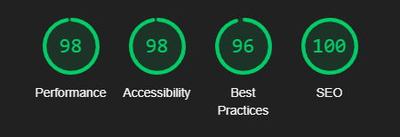
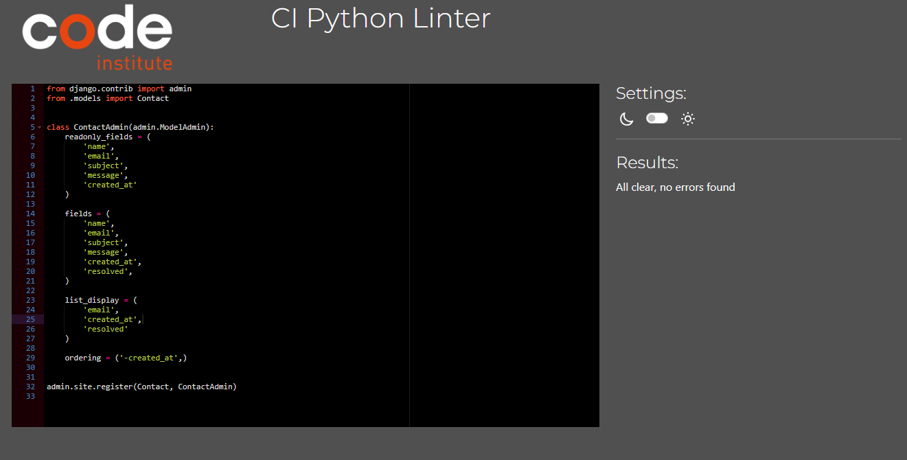

# The Tech SPot - Testing


[View The Tech Spot on Heroku]()

## CONTENTS

- [Automated Testing](#Automated-Testing)
  - [W3C Validator](#W3C-Validator)
  - [JavaScript Validator](#JavaScript-Validator)
  - [Lighthouse Testing](#Lighthouse-Testing)
  - [Wave Testing](#Wave-Testing)
  - [CI Python Linter](#ci-python-linter)
- [Manual Testing](#Manual-Testing)
  - [Testing User Stories](#Testing-User-Stories)
  - [Full Testing](#Full-Testing)
- [Bugs](#bugs)
  - [Solved Bugs](#solved-bugs)
  - [Known Bugs](#known-bugs)

## Testing

Testing was continuous throughout the website build. I used Chrome developer tools to identify and address any issues as they arose.

- My automated testing consisted of using W3C Validator, JSHint, Lighthouse, Wave the CI Linter Python and Coverage (Django Unit Testing).
- I then manually tested the user stories along with the functionality of the website.

## Automated Testing

### W3C Validator

### JavaScript Validator

All test successfully passed.

<details>
<summary>JS Hint Validator</summary>

## Checkout App

### stripe_elements.js


## Profiles App

### countryfield.js


</details>

### Lighthouse Testing

I took the opportunity to utilize Lighthouse within Chrome Developer Tools. This allowed me to test for performance, accessibility, best practices and the SEO (search engine optimization) of the website.

- All pages pass Googles lighthouse tests for Desktop and Mobile.

#### Desktop Testing

<details>
<summary>Lighthouse Desktop Testing Screen Shots</summary>

#### Homepage


#### Products Page


#### Products Detail Page


#### Add Product Page


#### Edit Product


#### Bag Page


#### Checkout Page


#### Checkout Success Page


#### Profile Page


#### Contact Page


</details>

#### Mobile Testing

<details>
<summary>Lighthouse Mobile Testing Screen Shots</summary>

#### Homepage


#### Products Page


#### Products Detail Page


#### Add Product Page


#### Edit Product


#### Bag Page


#### Checkout Page


#### Checkout Success Page


#### Profile Page


#### Contact Page


</details>

### Wave Testing

All pages pass the Wave validator.

<details>
<summary>Wave Testing</summary>

#### Homepage


#### Products Page


#### Products Detail Page


#### Add Product Page


#### Edit Product


#### Bag Page


#### Checkout Page


#### Checkout Success Page


#### Profile Page


#### Contact Page


</details>

### Coverage
<details>
<summary>Django Unit Testing Using Coverage</summary>

#### Coverage Testing

```bash
Name                                              Stmts   Miss  Cover
---------------------------------------------------------------------
bag\__init__.py                                       0      0   100%
bag\admin.py                                          1      0   100%
bag\apps.py                                           4      0   100%
bag\contexts.py                                      22      6    73%
bag\migrations\__init__.py                            0      0   100%
bag\models.py                                         1      0   100%
bag\templatetags\__init__.py                          0      0   100%
bag\templatetags\bag_tools.py                         6      2    67%
bag\test_views.py                                    23      0   100%
bag\urls.py                                           3      0   100%
bag\views.py                                         39     15    62%
checkout\__init__.py                                  1      0   100%
checkout\admin.py                                    12      0   100%
checkout\apps.py                                      6      0   100%
checkout\forms.py                                    28      0   100%
checkout\migrations\0001_initial.py                   6      0   100%
checkout\migrations\0002_alter_order_country.py       5      0   100%
checkout\migrations\0003_order_user_profile.py        5      0   100%
checkout\migrations\__init__.py                       0      0   100%
checkout\models.py                                   50     14    72%
checkout\signals.py                                   9      2    78%
checkout\test_forms.py                               22      0   100%
checkout\urls.py                                      4      0   100%
checkout\views.py                                    87     71    18%
checkout\webhook_handler.py                          74     58    22%
checkout\webhooks.py                                 28     19    32%
contact\__init__.py                                   0      0   100%
contact\admin.py                                      8      0   100%
contact\apps.py                                       4      0   100%
contact\forms.py                                     16      1    94%
contact\migrations\0001_initial.py                    5      0   100%
contact\migrations\__init__.py                        0      0   100%
contact\models.py                                    10      0   100%
contact\test_forms.py                                15      0   100%
contact\test_models.py                                9      0   100%
contact\test_views.py                                 6      0   100%
contact\urls.py                                       3      0   100%
contact\views.py                                     23     12    48%
env.py                                                5      0   100%
home\__init__.py                                      0      0   100%
home\admin.py                                         1      0   100%
home\apps.py                                          4      0   100%
home\migrations\__init__.py                           0      0   100%
home\models.py                                        1      0   100%
home\test_views.py                                    6      0   100%
home\urls.py                                          3      0   100%
home\views.py                                         3      0   100%
manage.py                                            11      2    82%
products\__init__.py                                  0      0   100%
products\admin.py                                     9      0   100%
products\apps.py                                      4      0   100%
products\forms.py                                    15      0   100%
products\migrations\0001_initial.py                   6      0   100%
products\migrations\__init__.py                       0      0   100%
products\models.py                                   21      0   100%
products\test_forms.py                                7      0   100%
products\test_models.py                              12      0   100%
products\test_views.py                               19      0   100%
products\urls.py                                      3      0   100%
products\views.py                                    88     61    31%
products\widgets.py                                   7      0   100%
profiles\__init__.py                                  0      0   100%
profiles\admin.py                                     1      0   100%
profiles\apps.py                                      4      0   100%
profiles\forms.py                                    18      1    94%
profiles\migrations\0001_initial.py                   8      0   100%
profiles\migrations\__init__.py                       0      0   100%
profiles\models.py                                   21      0   100%
profiles\test_models.py                               8      0   100%
profiles\test_views.py                               19      0   100%
profiles\urls.py                                      3      0   100%
profiles\views.py                                    26      6    77%
the_tech_spot\__init__.py                             0      0   100%
the_tech_spot\asgi.py                                 4      4     0%
the_tech_spot\settings.py                            46      0   100%
the_tech_spot\urls.py                                 5      0   100%
the_tech_spot\wsgi.py                                 4      4     0%
---------------------------------------------------------------------
TOTAL                                               927    278    70%
```
</details>

### CI Python Linter

- All Python code is consistent in style and conforms to the PEP8 style guide. The CI Python Linter has been used to check that the code conforms to PEP8 standard. This includes indentation, comments, trailing white spaces, maximum line length etc. 

- All tests successfully pass.

<details>
<summary>CI Python Linter Results</summary>

## The Tech Spot

### settings.py


### urls.py


## Bag App

### apps.py


### bag_tools.py


### context.py


### test_views.py


### urls.py


### views.py


## Checkout App

## admin.py


## apps.py


## forms.py


## signals.py


## models.py


## test_forms.py


## urls.py


## views.py


## webhook_handler.py


## webhooks.py


## Home App

## apps.py


## urls.py


## views.py


## test_views.py


## Products App

## admin.py


## apps.py


## forms.py


## models.py


## test_forms.py


## test_models.py


## test_views.py


## urls.py


## views.py


## widgets.py


## Profiles App

## apps.py


## forms.py


## models.py


## test_models.py


## test_views.py


## urls.py


## views.py


## Contact App

## admin.py


## apps.py


## forms.py


## models.py


## test_forms.py


## test_models.py


## test_views.py


</details>

### Manual Testing

### Full Testing

Full testing was performed on the following devices:

- Laptop:

  - Macbook Pro 2015 13 inch screen

- Mobile Devices:
  - iPhone 15 pro.
  - iPhone 12 pro.
  - iPhone 11 pro.
  - Phone X.

Each device tested the site using the following browsers:

- Google Chrome
- Safari

## Bugs